# Plugin Features

The following features are supported by the plugin, as listed below.

- [Running ballerina programs](#running-ballerina-programs)
- [Running ballerina tests](#running-ballerina-tests)
- [Import modules on-the-fly](#import-modules-on-the-fly)
- [Find usage](#find-usage)
- [Go to definition](#go-to-definition)
- [Formatting](#formatting)
- [Signature help](#signature-help)
- [Quick documentation](#quick-documentation)
- [Code completions](#code-completions)
- [Live templates](#live-templates)
- [Code actions](#code-actions)
- [Error diagnostics](#error-diagnostics)
- [File templates](#file-templates)
- [Spell checking](#spell-checking)

## Running ballerina programs

You can run Ballerina main/service programs with only few clicks. You don't have to add or change any configurations.
You can click on the gutter icon, right click menu or the run button
to execute a ballerina program.

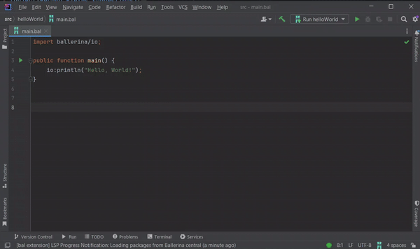

You can customize run configurations with custom environment variables, command options and program arguments. The same configuration options
are available for running ballerina tests as well.

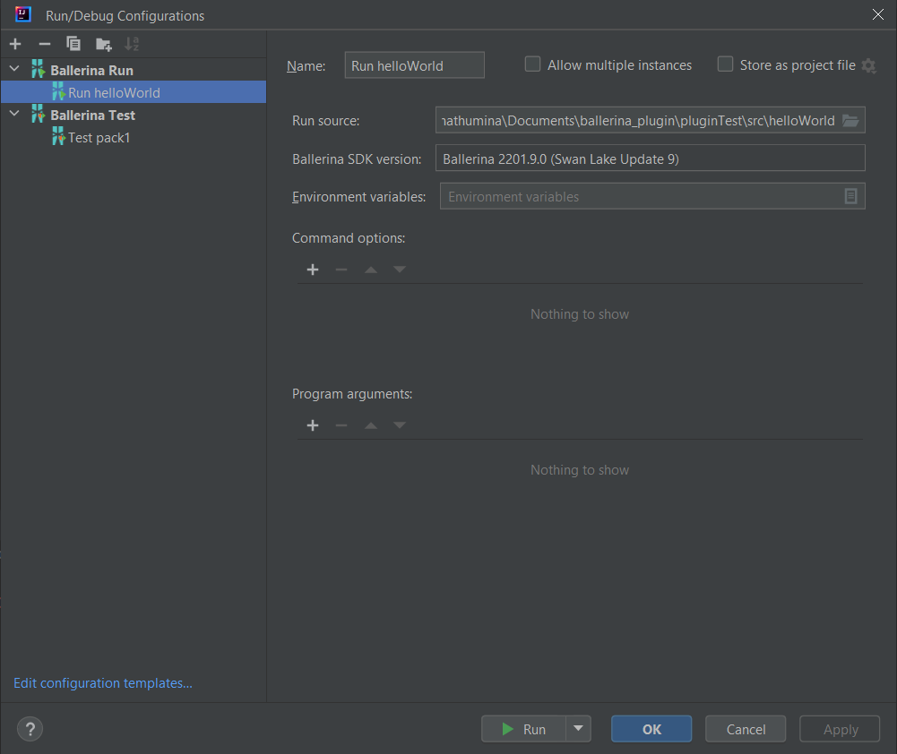

## Running ballerina tests

You can also run ballerina tests easily like running ballerina programs with right click actions and gutter icons.
You can run individual test functions by clicking the gutter icon next to it.
Package level test can be run by right-clicking on a package test file or
a package root level ballerina file. Module level test can be run by right-clicking on a module test file or a module root level ballerina file.

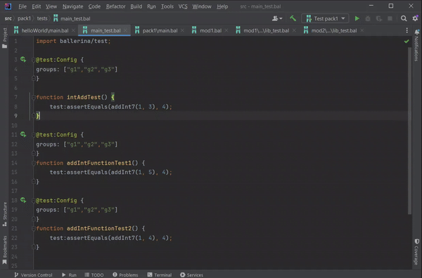

## Import Modules on-the-fly

This feature adds import declarations on the fly. All you need to do is to select the module name from the lookup list and then the module declaration will be added automatically.

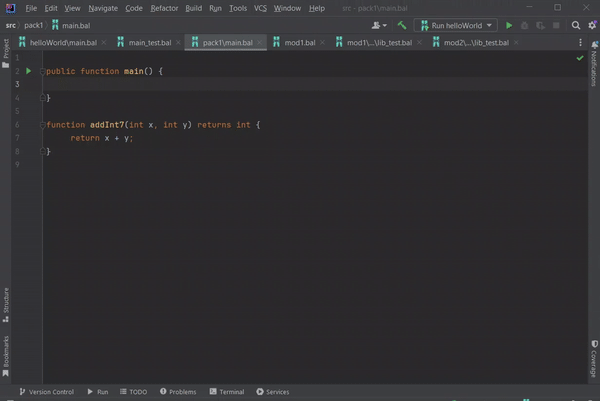

## Find usage

You can find usage of variables, functions, etc.

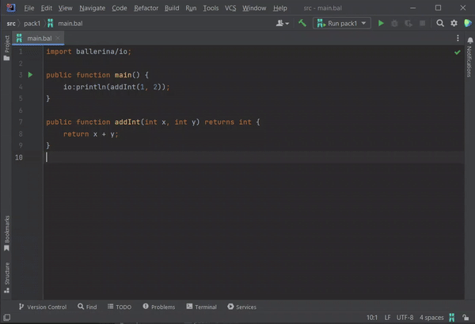

## Go to definition

You can go to definition of variables, function invocations, etc by `Ctrl`+`Click` on the reference.

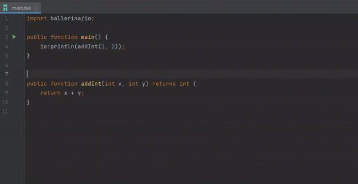

## Formatting

You can reformat the Ballerina codes by pressing `Ctrl`+`Alt`+`L`.

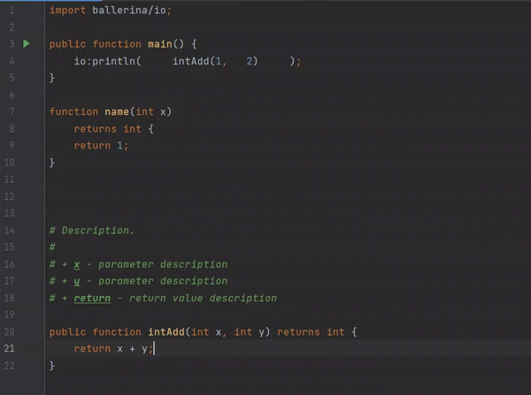

## Signature help

You can view the required parameters of a functions, remote functions, etc. after adding parenthesis or comma while typing

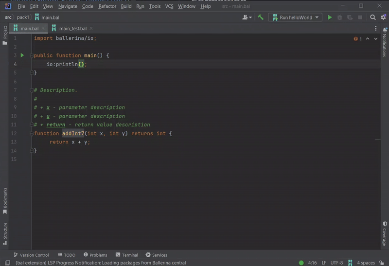

## Quick documentation

You can view the documentation of a functions, remote functions, etc by pressing `Ctrl`+`Q` or hovering over the element while pressing `Ctrl`.

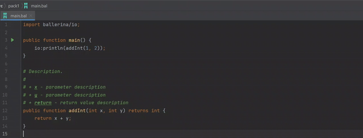

## Code completions

Completion suggestions are provided for all identifiers, keywords, module imports, etc.

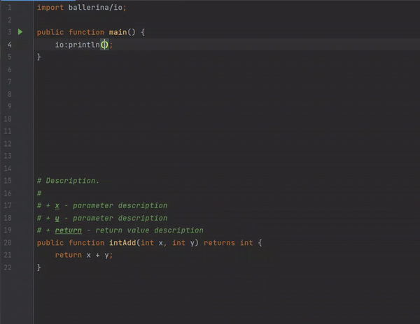

## Live templates

Live templates contain boilerplate codes and allows you to enter them easily. This will be available in completion suggestions.

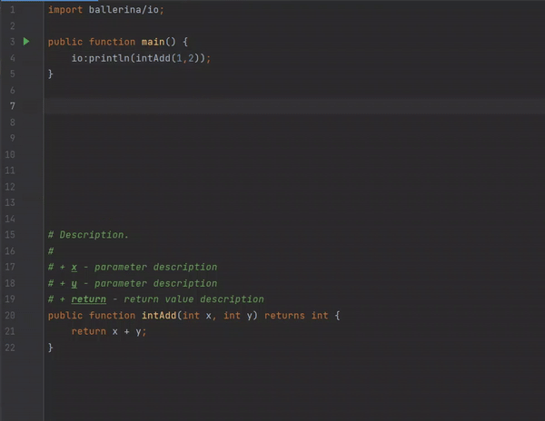

## Code actions

Code actions are provided for various purposes such as adding missing imports, fixing code errors, adding missing documentation, etc.
Click on the light bulb icon or press `Alt`+`Enter` to view the available code actions after placing the cursor on the error or the code.

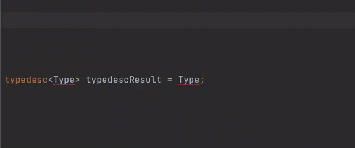

## Error diagnostics

Ballerina IDEA plugin provides semantic analyzing and diagnostics capabilities through Ballerina Language Server.  
These errors and warnings will be highlighted and you can view the error messages by hovering over the highlighted code.

## File templates

Three types of Ballerina file templates are available.
1) Ballerina Main - Contains a sample main program
2) Ballerina Service - Contains a sample service
3) Empty File

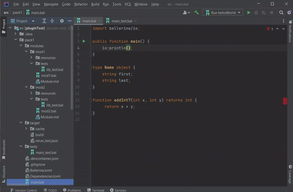

## Spell checking

Spell checking is enabled for all identifiers, comments and markdown text. You can get the suggested words by clicking the code action bulb.

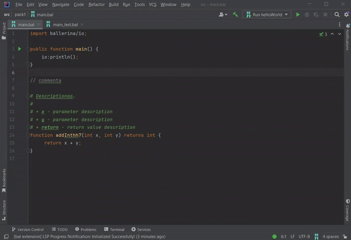

