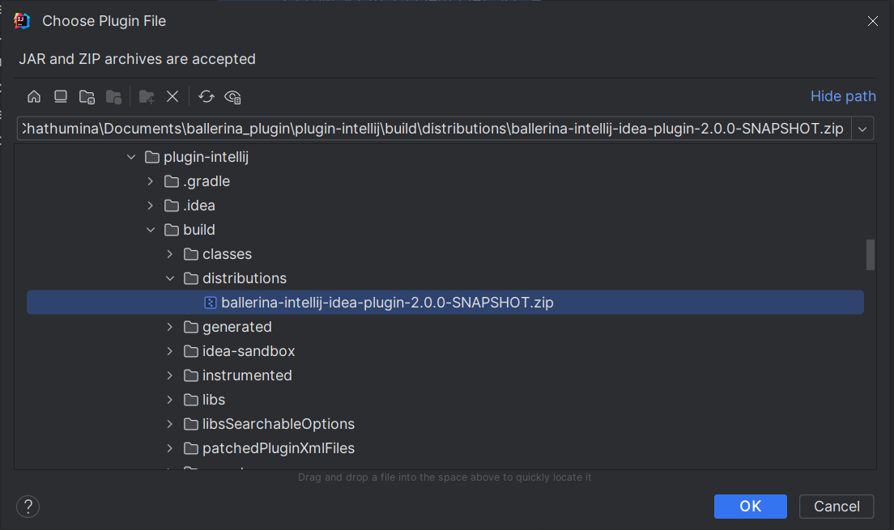

## Installing the plugin

### Installing using the ZIP file

If you have the zip file of a plugin snapshot, follow these steps to install the plugin.

1. Go to **Settings->Plugins**. Click the gear icon next to the `Installed` tab.

2. Select `Install Plugin from Disk...`. A dialog box will be displayed to select the zip file of the plugin. Select the plugin zip file and click **OK**
   

3. Select **Apply -> OK**.

4. Restart the IDE to apply the changes.
