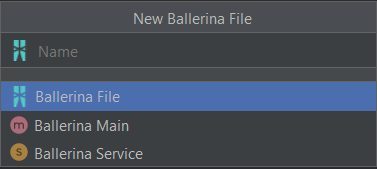
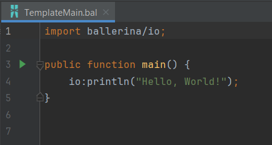
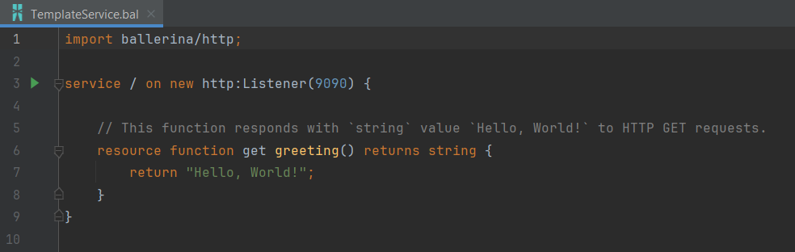

## Create new Ballerina project

### Create new Ballerina files

You can easily create a new ballerina file by right-clicking on the required location of the
directory tree in the project pane. Select **New -> Ballerina File**.

Three types of Ballerina file templates are available.
1) Empty Ballerina File
2) Ballerina Main - Contains a sample main program

3) Ballerina Service - Contains a sample service

