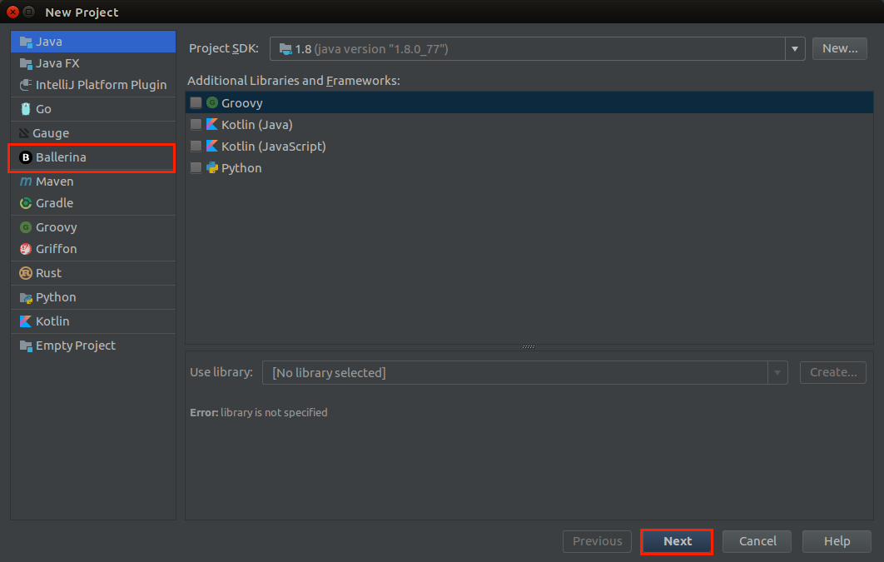
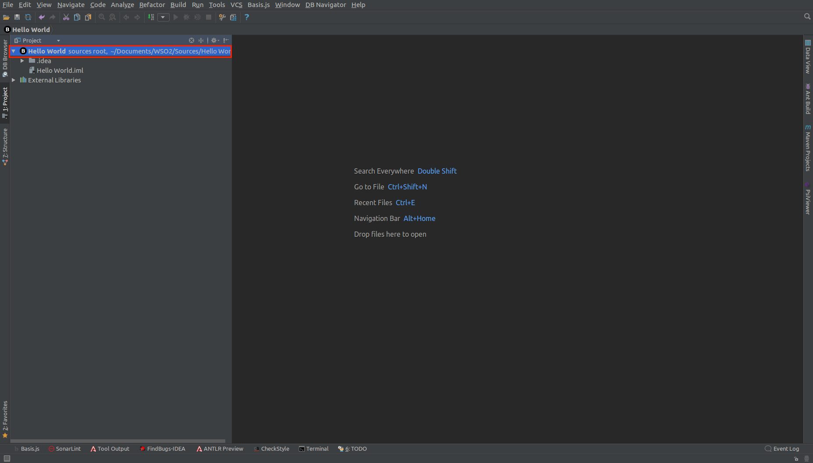

# Writing Hello World in Ballerina

## Creating a new Ballerina project

1. Go to **File -> New -> Project**. Select **Ballerina** project type and click **Next** button.

2. In the next step, we are prompted to select a SDK for the project. If you haven't already added a SDK, please follow [Setting up Ballerina SDK](../setting-up-ballerina-sdk) documentation to add a new SDK.

   Select the SDK and click **Next** button.

3. Update the project name and the location and click **Next** button.

Now you have successfully created a new **Ballerina** project.

## Creating a new Ballerina file

1. **Right click** on the project and select **New -> Ballerina File**.

2. Enter the file name and click **OK** button. We use **Ballerina Main** as the **Kind**. This will create a new file with a **main** function.

Now you should have a new Ballerina file with a **main** function.

## Running Ballerina Files

### Running Ballerina Mains

Near the main function, in the gutter area, **Run** icon can be found.

Clicking on this **Run** icon, available commands can be viewed.

Select **Run** command. This will run the main function and show the output in the **Run** window.

Note: You can right click on the file and run the main method as well.

### Running Ballerina Services

This is similar to running main functions. Near the service definition, in the gutter area, **Run** icon can be found. Clicking on this **Run** icon, available commands can be viewed. Select **Run** command. This will start the service and show the output in the **Run** window. Please note that running a Ballerina file with few services will start all services in that file.

Note: You can right click on the file and run the services as well.
